# Bixiv

纯前端项目，在1的基础上更新index.html和detail.html的js功能。

## 使用方式

使用服务器打开以避免跨域问题。

## 功能

index.html为主界面，detail.html为图片详细信息界面。

在主界面点击图片进入对应的detail界面，显示大图和图片相应的标题、作者等信息（时间有限未能加入每张图的信息）。

详细界面，可以在右侧菜单点击三个选项卡：滤镜、调整、剪切。

### 滤镜

显示了一排滤镜的按钮，点击其一可预览效果。点击应用将使当前的更改生效，点击重置将取消当前更改，选择其他选项卡将重置。

效果图-点击前：

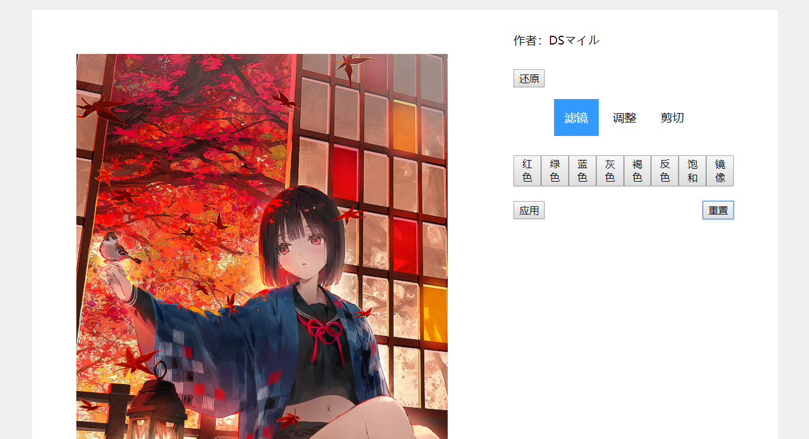

效果图-点击后（褐色）：

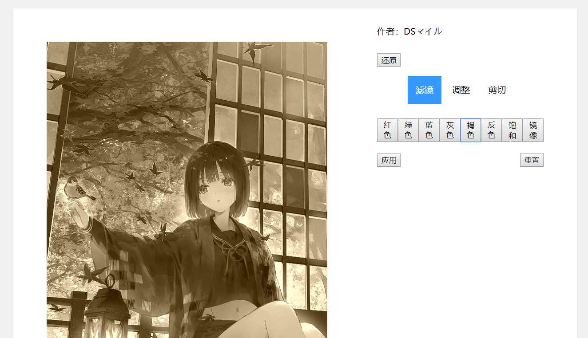

### 调整

可以调整图片的亮度、饱和度、色调。通过滑动条滑动或者输入数值完成后自动生成调整后的图片。点击应用将使当前的更改生效，点击重置将取消当前更改，选择其他选项卡将重置。

效果图-更改前：

效果图-更改后：

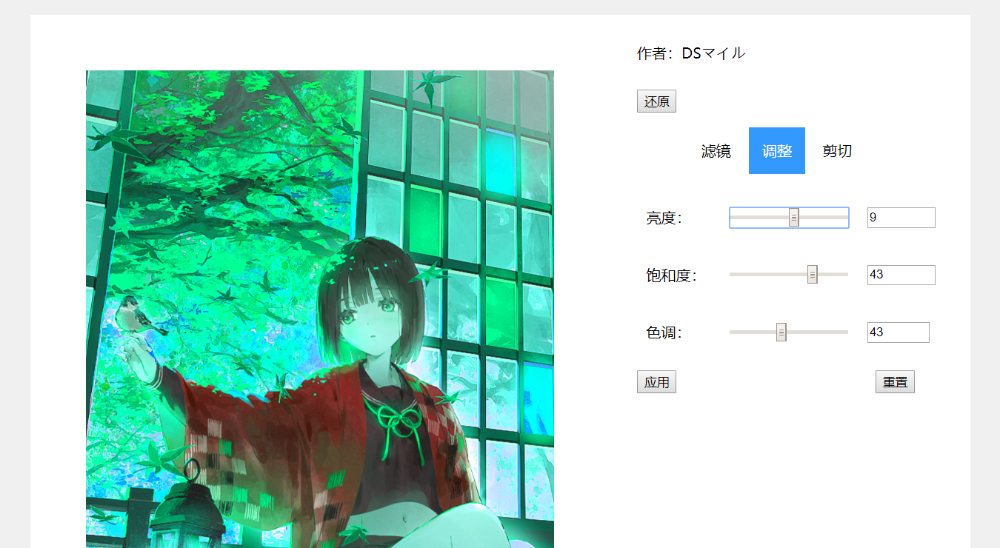

### 剪切

点击后自动出现可交互的剪切界面，可以在上面拖动、缩放选择框和图片。右边有预览图、逆时针旋转按钮、顺时针旋转按钮。点击应用将使当前的更改生效，点击重置将重置为初始状态，选择其他选项卡将退出剪切界面。

效果图：

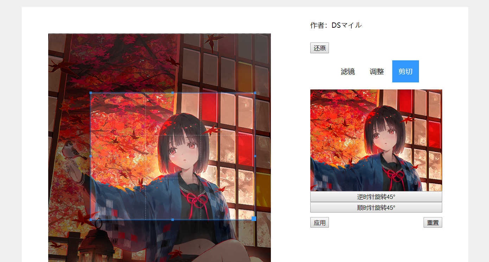

## 代码实现

### 主界面

更新了index.html，使用jquery根据图片列表在界面上动态添加图片。

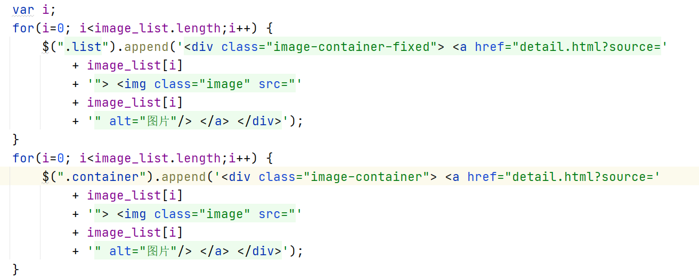

### 详细界面

更新了detail.html，添加基础功能和滤镜、调整、剪切三个功能。

#### 传参功能

url传参获取当前的图片。

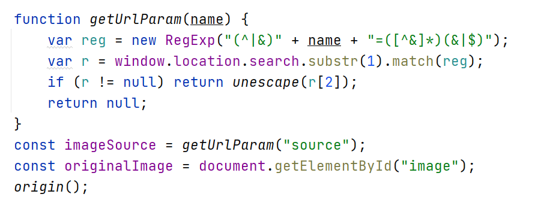

#### 选项卡

通过点击切换选项卡功能的实现，使用jquery。

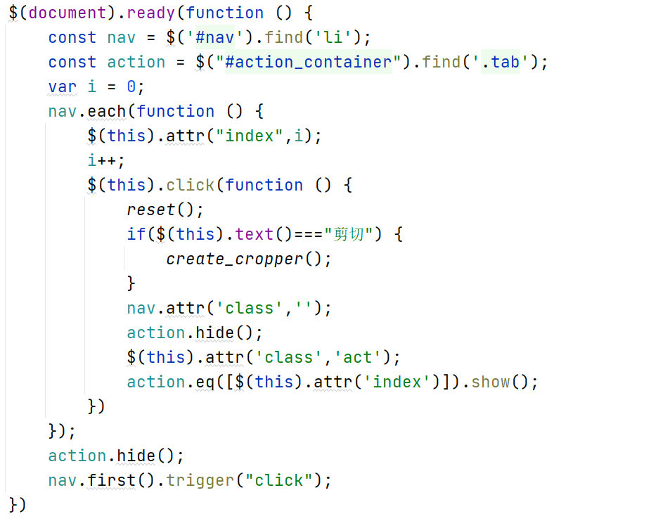

#### 滤镜功能

使用Lena.js的库实现，对其源代码稍作修改以呈现正确的图片大小。

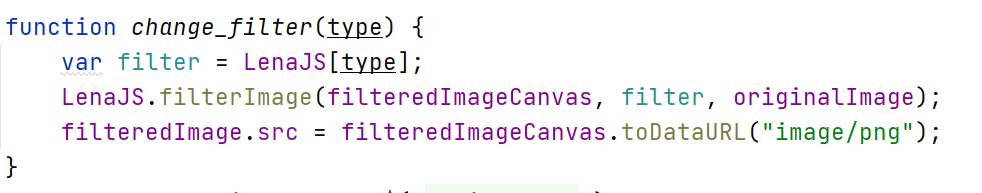

#### 调整功能

内嵌代码以实现滑动条和输入框的互相更新。

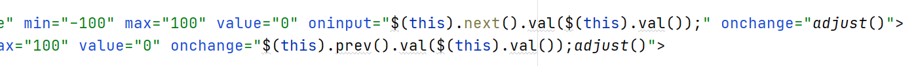

使用Caman.js的库，对其源代码稍作修改以避免html的元素替换。

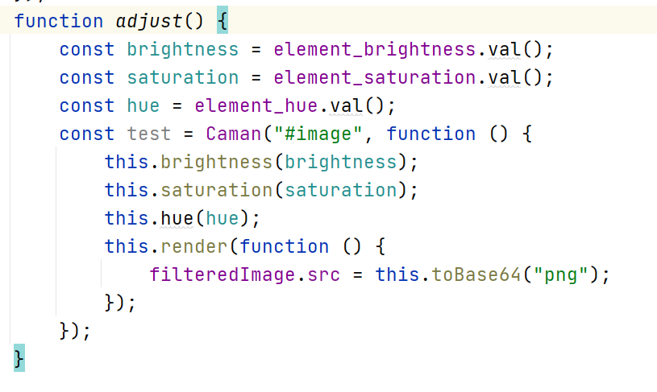

#### 剪切功能

使用Cropper.js的库实现。

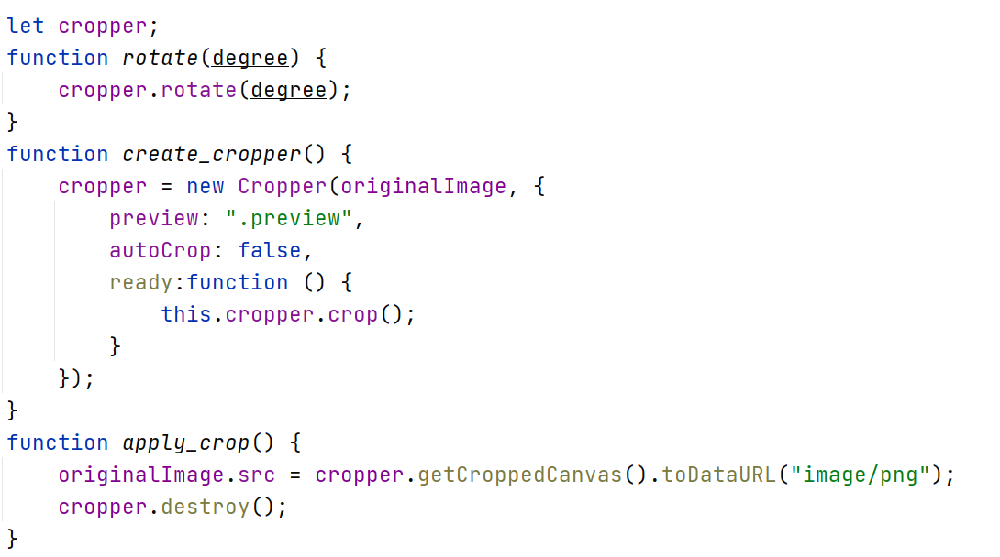