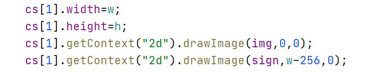
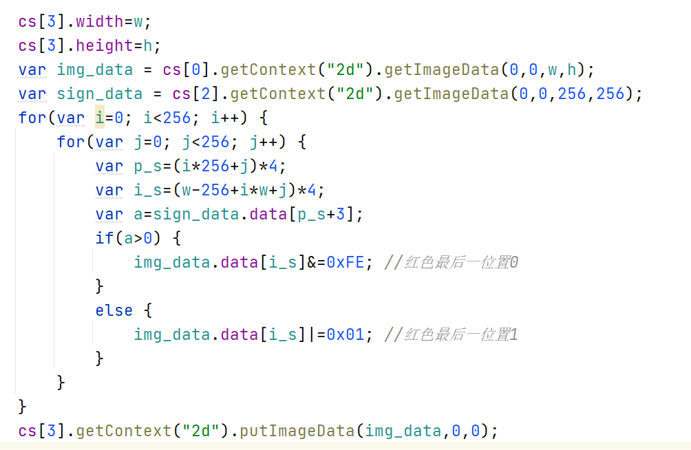
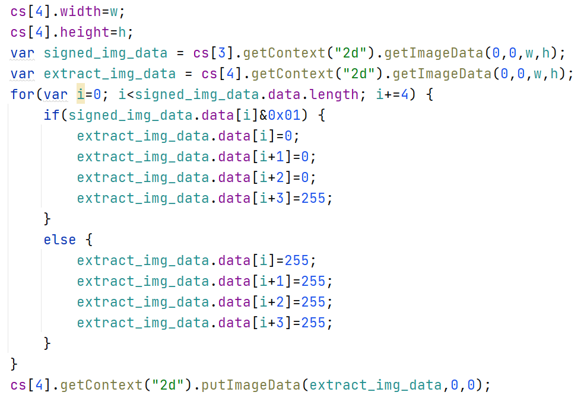

# 一个水印的实现
效果可以参见https://kumocuso4.github.io/Bixiv/

## 操作说明

必须通过服务器来访问网页，否则会遇到跨域问题。

原图和水印图片放在assets文件夹下，水印图片大小为256*256，原图大小大于水印图片大小。

通过服务器打开页面后可以看到以下的图片

## 关键代码

可见水印实现：

将原图和水印画在同一个画布上即可。

数字水印实现：

根据水印的透明度，将原图的对应位置的红色通道的最低一位置为0或1.

提取出数字水印：

根据加水印图像红色通道最低一位让结果图像的对应位置设置为黑或白。
