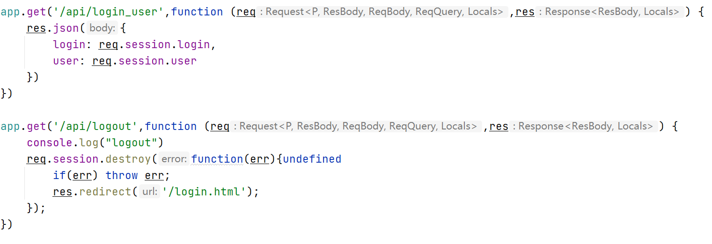
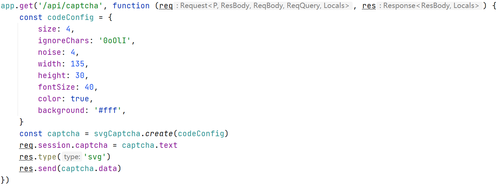
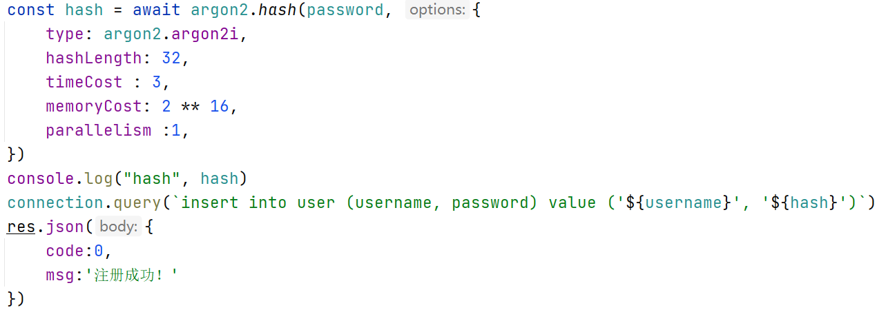
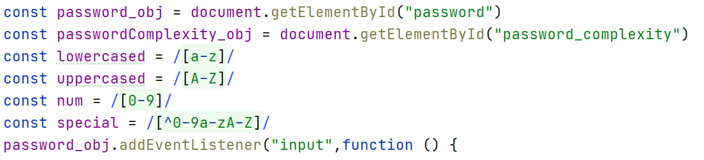
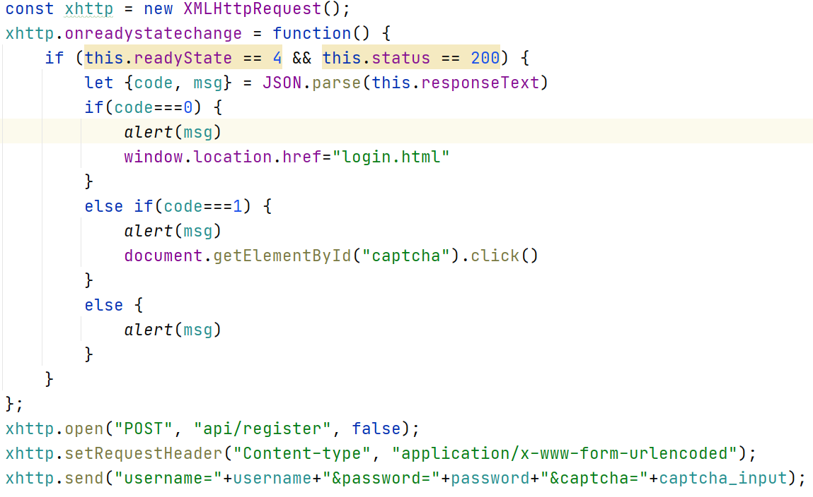
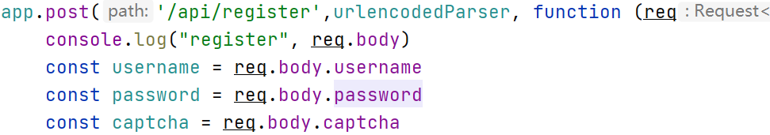
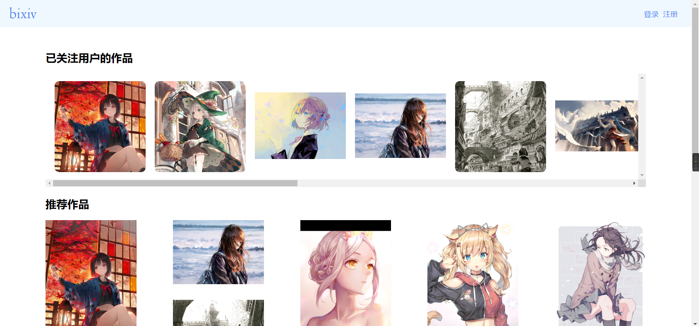
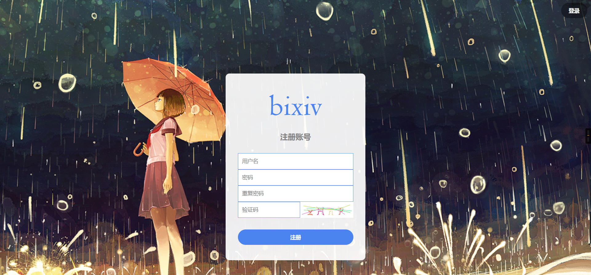
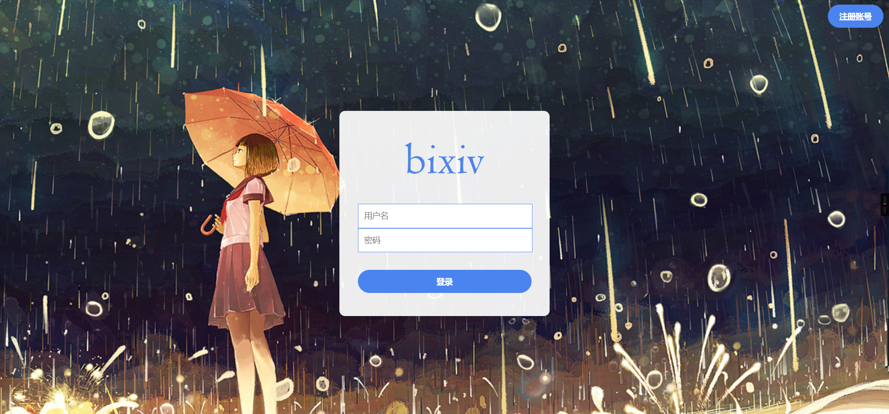
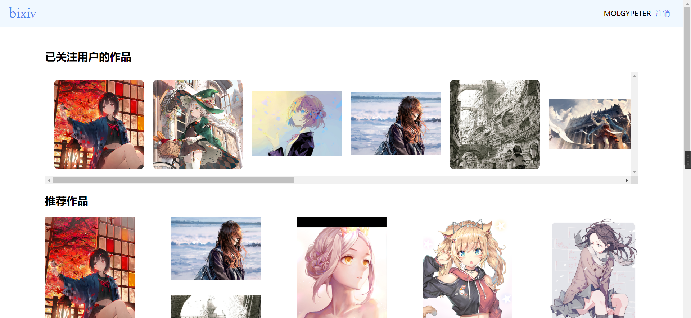

# Bixiv Version2

在Version 1的基础上添加了前端的js以及Nodejs的后端，实现了登录功能。

## 使用说明

index.js为后端文件，database.sql为建立数据库，其他是前端文件。

安装项目所需的库

```
npm install express express-session body-parser svg-captcha argon2 mysql
```

启动mysql并执行database.sql，将index.js中connection的user和password改为当前登录mysql的用户名和密码。

启动：

```
node index.js
```

网页在端口8080上可被访问

## 技术实现

### 服务器

使用express的框架，处理用户对于网页文件和api的请求。使用express-session存储用户的登录状态以及验证码的信息。



### 验证码

使用svg-captcha库生成随机的验证码文字和它的图片，图片发送至前端，验证码原文通过session存储在服务器上。用户提交时服务器接受用户提交的文字与验证码原文进行比对判断是否正确。



### 加密算法

使用argon2库进行加密，注册时服务器将用户密码加密后存入数据库。登录时argon2也可以将密码与加密的字符串进行处理比对。



### 密码复杂度

使用正则表达式进行判断用户密码中的小写字母、大写字母、数字、特殊字符的种类数，监听用户输入动态更新。



### 前后端通信

前端利用ajax发送get和post请求，使用urlencoded方式传递参数，服务器进行相应的处理，利用bodyparser处理参数。

前端：



后端：



## 界面和功能展示

基于作业一的功能进行拓展。

根目录导向index.html



此时处于未登录状态，右上角显示登录和注册的按钮。

进入注册界面。



需要输入用户名（4-20位），密码（6-20位，在输入时会提示密码强度但对此不作限制），重复密码（须和上一栏的输入相同），验证码（点击图片刷新验证码）。点击提交后，前端会对用户输入是否符合规定进行判断，若符合则发送请求由服务器判断是否存在问题，最后前端提示用户是否存在问题。若成功，则会跳转到登录界面。

进入登录界面。



输入正确的用户名和密码，点击登录，若存在问题会有相应的提示，若登陆成功会跳转到index界面。



此时处于登录状态，右上角可以看到用户名以及注销按键，离开页面后登录状态依然保存。点击注销，服务器会清除登录状态并返回登录界面。